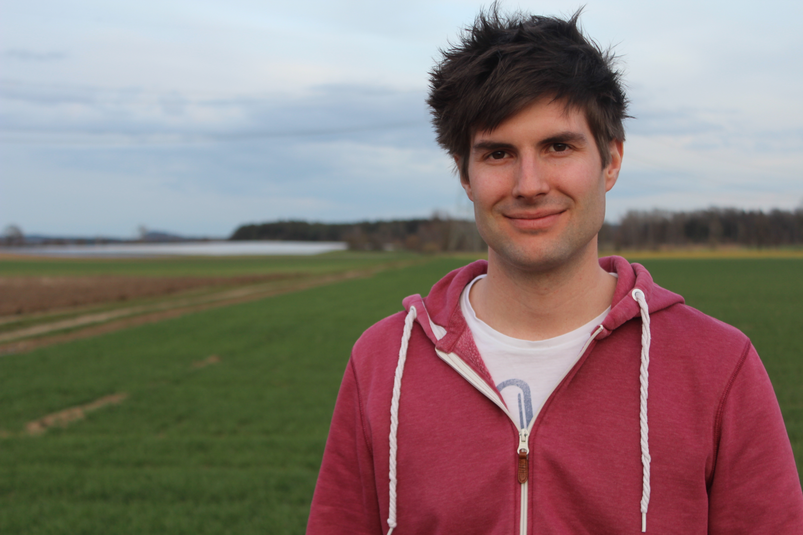

*This picture is 10 years old, but I still look the same, just older :)*

**TL;DR** - I'm a normal guy who leads a decent life in the countryside near Augsburg, Germany. I'm 37 years old and always trying to learn something new. I love being a software developer. Outside of work, I try to stay active with playing tennis, going on hikes and working out with friends.

## Work

I have been making websites for over 20 years. I use PHP, JavaScript, HTML and CSS. I spent most of my professional career working with WordPress and building themes and plugins for it. My focus is frontend development - creating beautiful user interfaces and web layouts. I design, too, although I would not consider myself a designer. In the last few years my work heavily shifted to TypeScript and React.

As a 20-year-old, my biggest dream was to start my own company and work on my own. So I did that. After a short phase of freelancing I found my passion in creating and selling WordPress themes. I started my own [theme shop](https://themezee.com) in 2010 and still run it today. 

But, nowadays, it is only a side-business. The market has shifted and business has collapsed. In 2023, I felt it was time for a new challenge. I also wanted to work in a team and on more complex sites. So I joined [Syde](https://syde.com), Europe’s biggest WordPress agency and one of the leading WordPress agencies worldwide. Together with my colleagues, we have led many sophisticated WordPress projects in the enterprise market.

## Hobbies and interests

I really enjoy tennis. I'm not particularly good at it, as I only started as an adult—but it's a lot of fun. I play in a team and I take pleasure in training together and competing with other teams. I'm also the chairman of my local tennis club. This means that I - together with my committee of 12 people - organize the day-to-day management, games and training, as well as many events during the season. Our largest planned project is the construction of a new tennis clubhouse, as the current one is outdated and run down.

Another hobby I recently discovered is hiking. Being close to the Alps, I can be in the mountains in two hours. I love the act of simply walking, switching off mentally, and climbing a mountain peak. The older I get, the more I like being outdoors and in nature, simply enjoying the view and the scenery. 

Of course, this also means I like traveling to other countries. Last year, I visited Iceland - which is a completely different world with its beautiful waterfalls, volcanic landscapes, and glaciers. My next travel destinations are the Lofoten Islands in Norway and the Rocky Mountains in Canada.

Beyond that, I enjoy reading and watching movies. My favorite genre is science fiction. My favorite movies are probably The Matrix and Interstellar, my favorite book is Ender's game by Orson Scott Card.

## Education

I'm a very curious person. I can get interested in all kind of topics - especially if it's technology-, science- or business-related. I enjoy learning new things and can quickly grasp new concepts. 

In 2009, at the age of 20, I completed a three-year dual vocational training program as an IT specialist at Fujitsu Siemens Computers in Augsburg. There, I gained in-depth knowledge of PHP, SQL, and web development in general.

I have a Bachelor of Arts degree in Business Administration from the University of Applied Sciences, Augsburg. Working as a self-employed person with my own business, I also wanted to be well versed in the economic side of things. I completed my studies in 2016.

In my early 30s, I studied artificial intelligence at the Technical University of Ingolstadt for four semesters. One of my biggest regrets in life is that I dropped out of my studies to focus more on my then failing business. Nevertheless, I have acquired valuable basic knowledge about AI.
